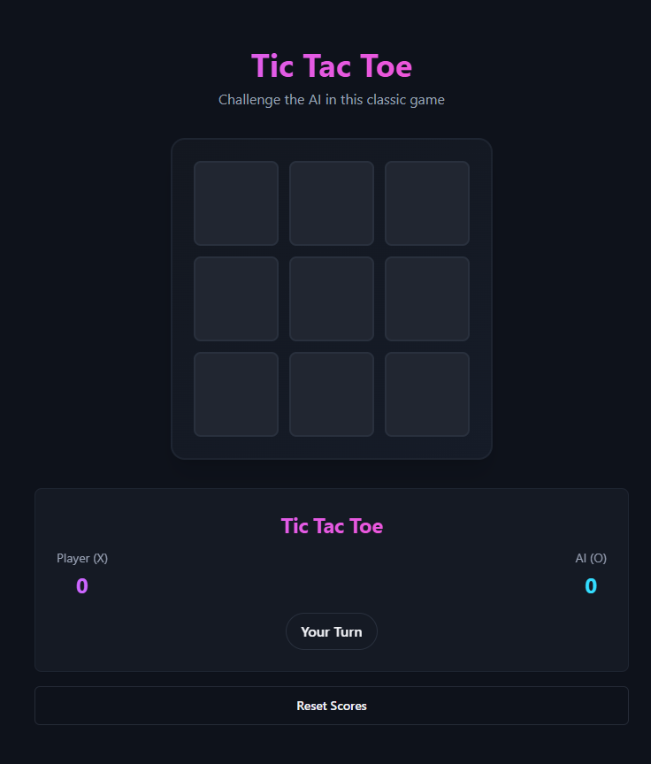
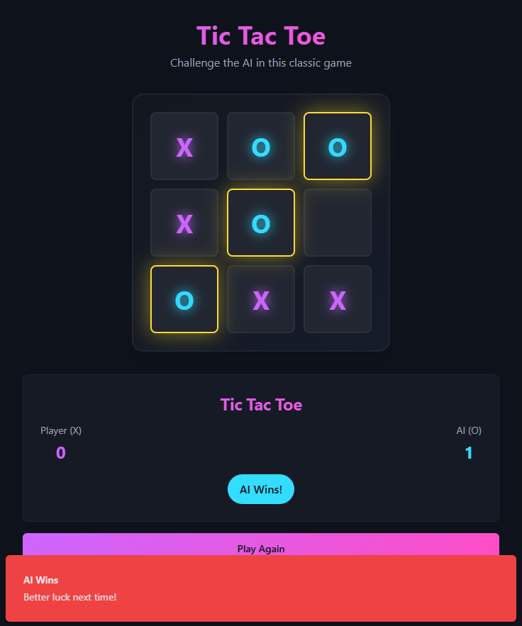

# React Dashboard Project

## Screenshuts

- Capture d'écran du **GameBoard** : affiche les 9 cellules du plateau de jeu, le score, le bouton de réinitialisation et l’indicateur du tour du joueur en cours.



- Capture d'écran de l’état **gagnant** : montre la ligne gagnante mise en évidence après une victoire, ainsi que l’affichage du vainqueur.



## Description

Ce projet est une interface moderne construite avec :

- ⚡️ Vite (pour un démarrage rapide)
- 🧠 React + TypeScript
- 🎨 Tailwind CSS pour un style rapide et responsive
- 🧩 shadcn/ui pour des composants UI accessibles et élégants

### Prérequis

- Node.js (version 18+ recommandée)
- npm

### Étapes d'installation

```bash
# 1. Cloner le dépôt
git clone https://github.com/ton-nom-utilisateur/ton-nom-depot.git

# 2. Se rendre dans le dossier du projet
cd ton-nom-depot

# 3. Installer les dépendances
npm install

# 4. Lancer le serveur de développement
npm run dev
```

"# tictactoe-game-react"
"# tictactoe-game-react"
"# tictactoe-game-react"
"# tictactoe-game-react"
